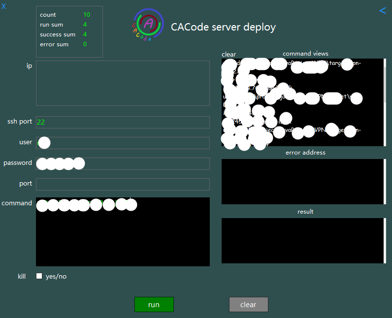
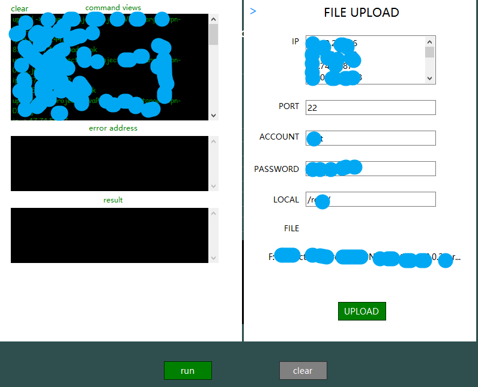

# com.cacode.restartService

    批量操作服务器

## 功能点：

    批量执行命令
    批量上传文件
    批量杀死端口

## 界面介绍

图：

    左上角显示：
        count:服务器数量
        run sum:已执行数量
        success sum:成功数量
        error sum:失败数量
    中间：
        左边：
            输入ip地址，以换行分割每个ip地址
            ssh端口默认22
            登陆的用户名
            登录密码
            部署或杀死的端口
            需要运行的部署命令或其他命令
            是否在执行前杀死部署端口
        右边：
            左上角clear清空结果框
            正在执行、已经执行的命令和错误提示的显示
            运行错误的ip地址
            错误的提示信息
        右上角：
            按下`<`号显示显示上传文件视图
    下面：
        运行命令
        清空所有输入框
    上传文件：
        左边：
            左上角clear清空结果框
            正在执行、已经执行的命令和错误提示的显示
            运行错误的ip地址
            错误的提示信息
        右边：
            输入ip地址，以换行分割每个ip地址
            ssh端口默认22
            登陆的用户名
            登录密码
            上传文件的位置，默认/root
            上传的文件地址，拖动文件至THAT文字
            上传按钮，点击开始批量上传
